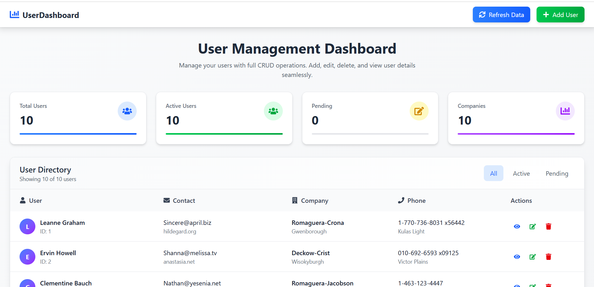
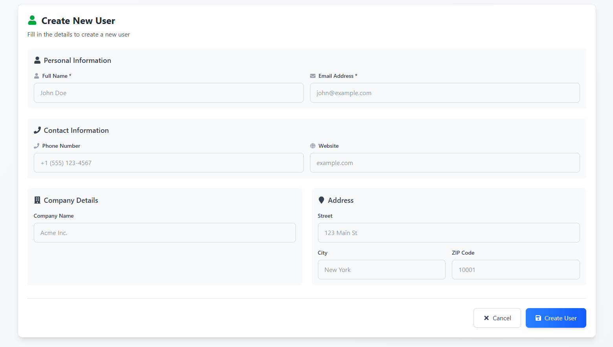
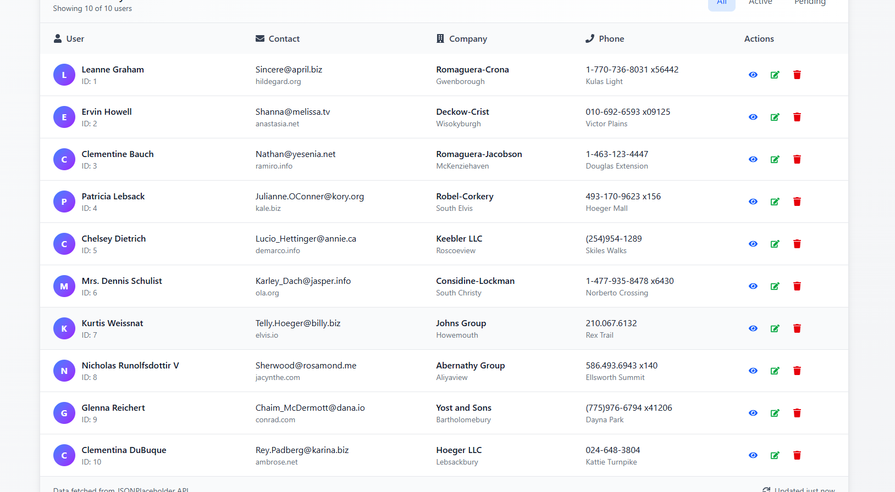
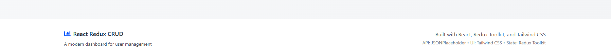

<div align="center">
  <br />
    <h1 align="center">React Redux CRUD Dashboard </h1>

<br />

<div>

</div>

</div>


## <a name="introduction">✨ Introduction</a>
A modern, responsive user management dashboard built with React, Redux Toolkit, and Tailwind CSS. This application demonstrates full CRUD (Create, Read, Update, Delete) operations with real API integration using JSONPlaceholder.


## ✨ Features

- Complete CRUD Operations: Create, read, update, and delete users

- Modern UI/UX: Clean, responsive design with Tailwind CSS

- State Management: Redux Toolkit for predictable state management

- Real API Integration: Fetch data from JSONPlaceholder API

- Loading & Error States: Graceful handling of API states

- Responsive Design: Works on mobile, tablet, and desktop

- Dashboard Analytics: Statistics cards showing user metrics

- Interactive Components: Modals, forms, and tables with smooth animations

- Filtering & Sorting: Tab-based user filtering

## ⚙️ Setup Instructions

### Installation

1.  **Clone the repository:**
    ```bash
    git clone <repository-url>
     https://github.com/Amit-yadav099/CrossroadWork.git
    ```

2.  **Install dependencies:**
    ```bash
    npm install
    # or
    yarn install
    ```

3.  **Run the development server:**
    ```bash
    npm run dev
    # or
    yarn dev
    ```

5.  **Open the app:**
    Navigate to [http://localhost:5173](http://localhost:3000) to view the application.


## <a name="Project">Project Structure</a>
``` bash
redux-crud-dashboard/
├── public/              # Static assets
├── src/
│   ├── app/
│   │   └── store.js     # Redux store configuration
│   ├── components/      # Reusable UI components
│   │   ├── UserTable.jsx
│   │   ├── UserForm.jsx
│   │   ├── StatsCard.jsx
│   │   ├── LoadingSpinner.jsx
│   │   └── ErrorMessage.jsx
│   ├── features/
│   │   └── users/
│   │       └── userSlice.js  # Redux slice with CRUD operations
│   ├── services/
│   │   └── api.js       # API service layer
│   ├── App.jsx          # Main application component
│   └── main.jsx         # Application entry point
├── index.html
├── package.json
├── vite.config.js
└── README.md
```
## <a name="key-featuere">🎯 Key Features in Detail</a>

📊 Dashboard Overview
- Real-time statistics cards showing user metrics

- Clean table layout with user information

- Quick action buttons for CRUD operations

<br>

👤 User Management
- Create: Add new users with a comprehensive form

- Read: Display users in a sortable table

- Update: Edit existing user information

- Delete: Remove users with confirmation

<br>

🎨 UI/UX Features
- Responsive Design: Adapts to all screen sizes

- Loading States: Animated spinners during API calls

- Error Handling: User-friendly error messages

- Form Validation: Real-time input validation

- Modal Dialogs: Smooth transitions for details view

<br>

📚 Technologies Used
- React 18 - Frontend library

- Redux Toolkit - State management

- React Redux - React bindings for Redux

- Tailwind CSS - Utility-first CSS framework

- Axios - HTTP client for API requests

- React Icons - Icon library

- Vite - Build tool and development server

- JSONPlaceholder - Mock API for development

<br>

📱 API Integration
This project uses JSONPlaceholder as a mock API:

- Base URL: https://jsonplaceholder.typicode.com

<br>

Endpoints:

- GET /users - Fetch all users

- POST /users - Create new user

- PUT /users/:id - Update user

- DELETE /users/:id - Delete user

<br>

🔄 Redux State Management
The application uses Redux Toolkit with the following structure:

```bash
javascript
// User slice state shape
{
  users: [],           // Array of user objects
  loading: false,      // API loading state
  error: null,         // Error messages
  currentUser: null,   // Currently selected user
}
```

Redux Actions

```bash
fetchUsers() - Fetch users from API

createUser(userData) - Add new user

updateUser({id, userData}) - Update existing user

deleteUser(id) - Remove user
```

🎨 Styling
This project uses Tailwind CSS for styling with the following customizations:

- Custom Configuration
- Responsive breakpoints
- Custom color palette
- Animation utilities
- Component classes

<br>

Design System
- Primary Color: Blue (#3B82F6)
- Secondary Color: Gray (#6B7280)
- Success: Green (#10B981)
- Warning: Yellow (#F59E0B)
- Error: Red (#EF4444)


## <a name="Images">Different Pages UI</a>




